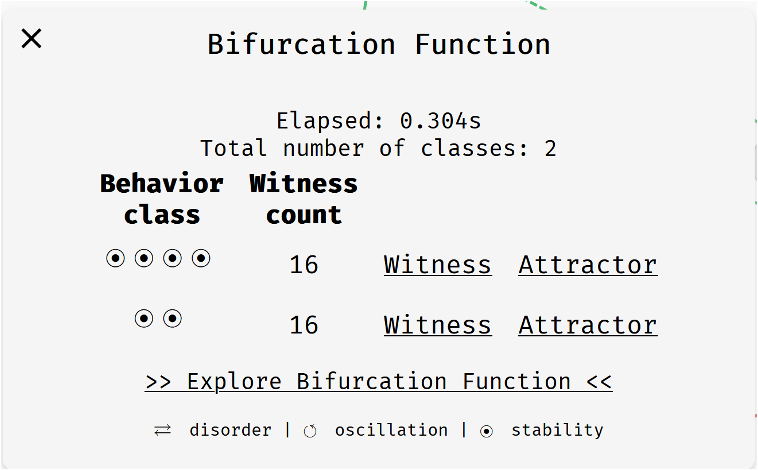
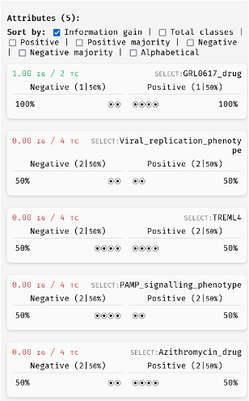
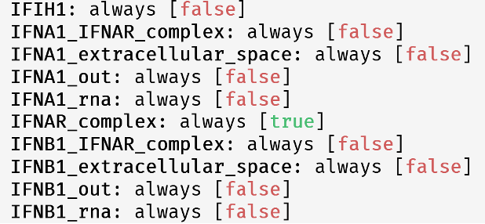
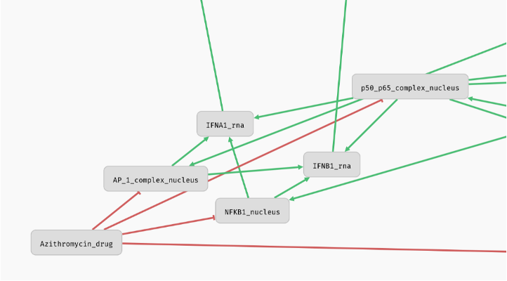
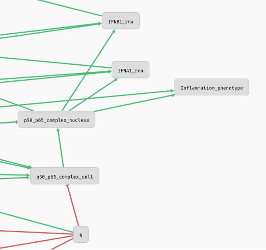
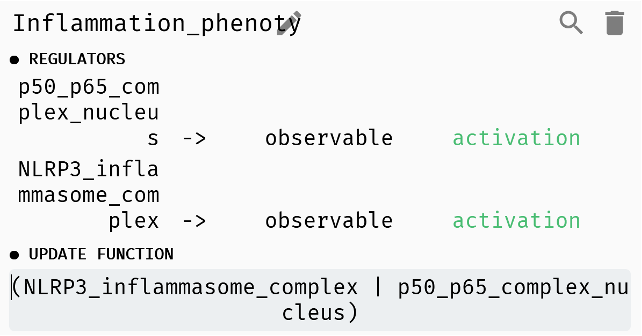
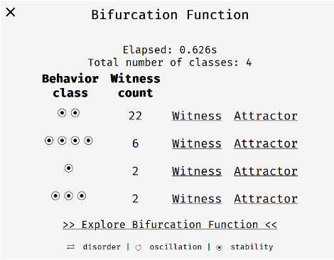
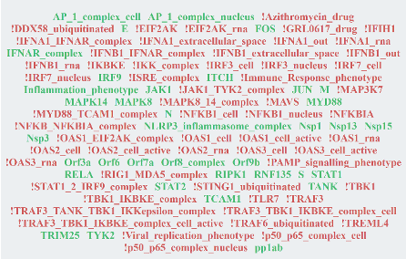
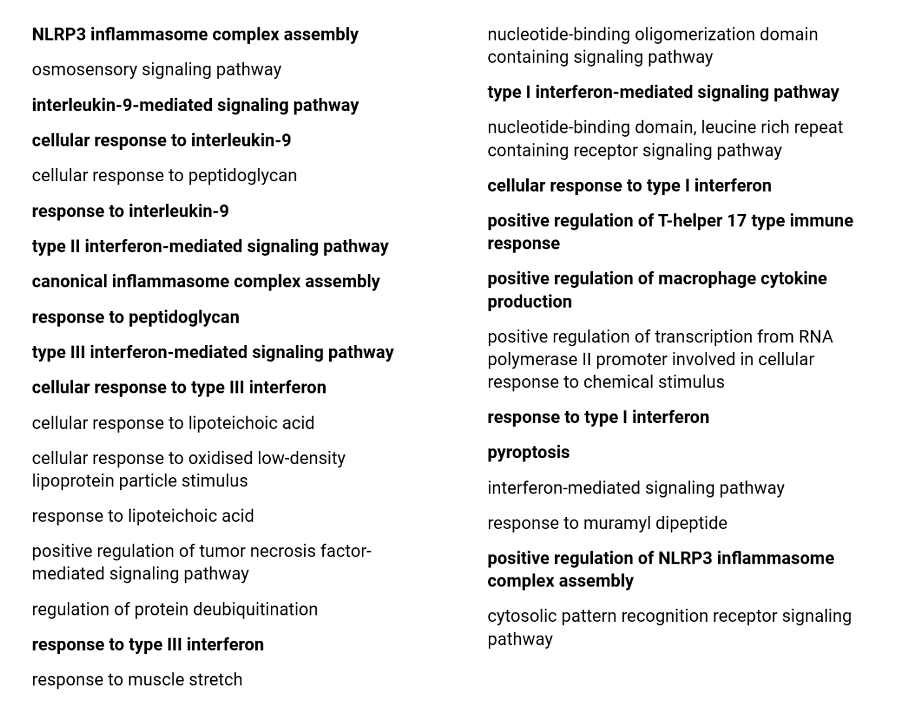

### **1. Introduction**  

**Interferons** are a group of **signaling proteins** and a **cytokine subgroup**, produced by host cells in response to **viral infections** or other pathogens. In this project, we work with a **Boolean model** of **signaling pathways** that control the immune response of a cell depending on the presence of these proteins in the extracellular environment.  

After loading the model into the **AEON tool**, we isolate the drugs **Azithromycin** (an **antibiotic**) and **GRL0617** (a **competitive non-covalent inhibitor** of the **PLpro enzyme family (Protein-like Protease)**). The **output phenotypes** of the model are **inflammation** and **immune response**. By linking **interferon nodes** to those representing **interferons** in the extracellular environment, we create **positive feedback**.  

---

### **2. Modeling the Presence of the Virus in the Cell**  

The **presence of a virus** in the cell is modeled by the presence of its **viral proteins** in the cell. These proteins include:

- **M** (determines the virus shape, central to viral assembly)
- **S (Spike Protein)** (binds to the host cell receptor)
- **E (Envelope Protein)** (interacts with M protein to form the virus membrane)  
- **N** (binds to viral genomic RNA, forming the nucleocapsid)
- **Orf6, Nsp3, pp1ab, Orf9b, Nsp15, Nsp1, Orf7a, Orf3a, Orf8, Nsp13**

The **bifurcation function** in this case results in **two classes** with slightly different behaviors:  

1. **Bistability**  
2. **A class with four stable attractors**  

The **AEON model** applies **attractor bifurcation analysis**, examining how **Boolean network parameters** affect long-term behavior. From a **graph theory perspective**, we look for **strongly connected components** in the **state transition diagram**.  

From **stability analysis**, we observe that in the **presence of viral proteins**, the **inflammation phenotype** **always manifests**. This indicates that **inflammation is independent of Azithromycin or GRL0617**.  

The **immune response phenotype** does **not manifest** at all if **GRL0617 is absent**. If **GRL0617 is present**, it appears in **half of the cases** (i.e., in half of the attractors where this drug is present). Other variables that do not affect the **update function** have **zero information gain** in classification.

One **notable finding** in the **stability analysis** is that the **positive feedback loop we created never manifests**.

- **Cause:** **Azithromycin** inhibits **AP_1_complex_nucleus, NFKB1_nucleus, and P50_P65_complex_cell**, which activate **RNA interferons IFNA1 and IFNB1**. This means that **if the cell does not produce interferons, none are released into the extracellular space**.

- In our model, the **cell depends on its own interferon production**, whereas **normally**, interferon signaling works as follows:  
    - A cell detects a **pathogen**, produces **interferons**, and releases them into the **extracellular space**.  
    - A **neighboring cell** receives the signal and triggers an **immune response** (e.g., production of enzymes that degrade **viral mRNA** or inhibit **protein synthesis**, thereby stopping viral replication).  

The second **disruptor of positive feedback** is the **viral N protein**, which **indirectly inhibits p50_p65_complex_cell**, preventing the production of RNA for interferons.  

At first glance, it might seem that due to **inactive p50_p65 in the nucleus**, the **inflammation phenotype** should also **not manifest**. However, the explanation lies in the **logical OR operator** in the **phenotype function**.

---

### **3. Modeling the Absence of the Virus in the Cell**  

To model the **absence of the virus**, we set **all viral protein nodes to FALSE** in the **Boolean network**. This results in **four potential classes**, each containing only **one stable attractor**. The number of stable states differs between the classes.  

From **stability analysis**, we conclude that the **inflammation phenotype never manifests** in **any instance** of the model. Thus, it is **unnecessary to examine further cases** where **inflammation would occur in the absence of the virus**.  

---

### **4. Gene Enrichment Analysis**  

For **gene enrichment analysis**, we use the **bistable class** from the case where the **virus is present** in the **host cell**. The attractor converges to **two stable states**, distinguishing whether a given **protein or complex** is present in the cell.  

To analyze **enrichment**, we:  

1. Take the **intersection** of the two states (proteins present in both).  
2. **Filter out human proteins** and **remove phenotypes**.  
3. Use **NCBI** to determine the **gene origin** for each protein.  
4. Translate **complexes** into their corresponding **proteins** (e.g., **AP_1_complex** consists of **FOS and JUN**).  

The resulting set of **proteins (genes)** includes:  
**FOS, IRF9, ITCH, JAK1, JUN, MAPK14, MAPK8, MYD88, CASP1, NLRP3, PYCARD, RELA, RIPK1, RNF135, STAT1, STAT2, TANK, TCAM1, TRIM25, TYK2**.  

**Gene enrichment analysis** is a **statistical method** used to identify **overrepresented gene groups** in **biological functions or pathways**. This provides **insights into biological processes** associated with the given gene set.  

The **Gene Ontology (GO) request** returns a **list of biological processes** that link these proteins.  

- **Fold enrichment** quantifies the significance of gene overrepresentation in a given group (in this case, **human proteins**).  
- The following list includes all biological processes with a **fold enrichment >100** for our **gene set**.  
- **Highlighted processes** are directly related to **inflammation or immune response**.

This analysis confirms that the **genes stably expressed in this attractor** are strongly associated with **immune response processes under various conditions**.
